# 从一个微信小游戏入门计算机图形学

## 计算机图形学简介

计算机图形学(Computer Graphics)的内容非常丰富，又和许多学科有交叉，随着技术的发展，它触及到的范围又不断延伸，因此很难对计算机图形学下一个准确的定义。

简单地说，计算机图形学的主要研究内容就是研究如何在计算机中表示图形、以及利用计算机进行图形的计算、处理和显示的相关原理与算法。图形通常由点、线、面、体等几何元素和灰度、色彩、线型、线宽等非几何属性组成。狭义上讲，它和数组图像处理互为逆过程: 计算机图形学用计算机来画图像，数字图像处理采集现实中的图像用计算机进行处理。但是我们不会特别强调他们对立的一面，因为这两个学科有很多共同的子领域，很多概念和方法也是相通的。

## 我们关注的领域

从应用的方面看，计算机图形学的应用主要分两类:

* 一类是应用在特定的专业的领域
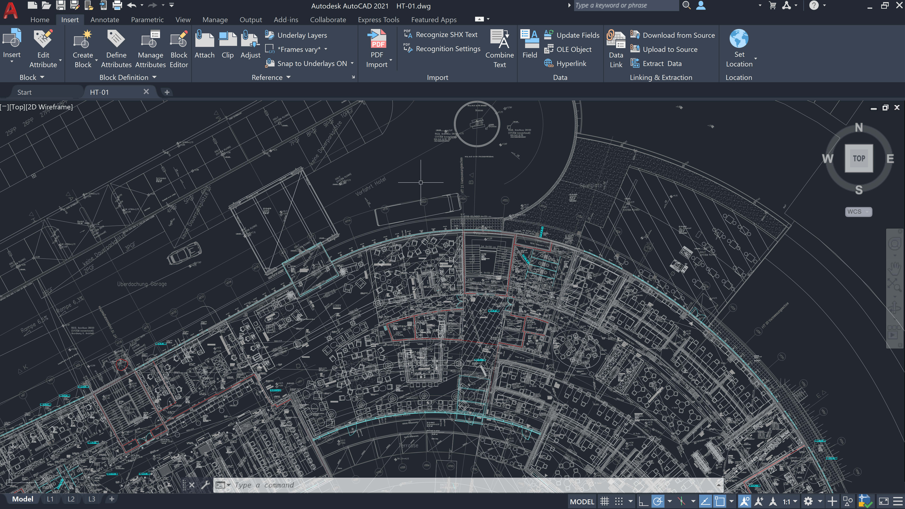
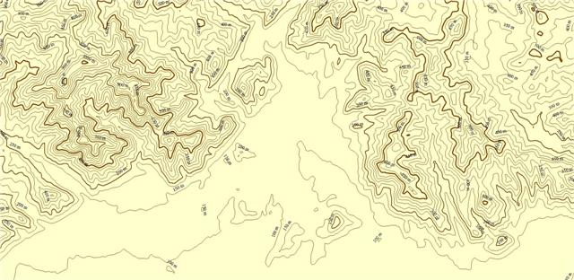
* 一类是模拟现实世界，也就是通常所说的真实感图形

从适用性上看第二类更通用，目前也是计算机图形学的主要目的之一。我们接下来也主要关注第二类

## 计算机图形学的主要内容

该学科主要解决的是如果用计算机表达几何图形。经过几十年的发展，其所研究的内容也已经极其丰富。但主要内容可以归类为以下4种

### 1. 建模(Modeling)

要在计算机中表示一个三维物体，首先要有它的几何模型表达。因此，三维模型的建模是计算机图形学的基础，是其他内容的前提。表达一个几何物体可以是用数学上的样条函数或隐式函数来表达；也可以是用光滑曲面上的采样点及其连接关系所表达的三角网格来表达（即连续曲面的分片线性逼近）
建模的方法

* 软件手工直接建模，如3d max，maya等建模软件
* 基于语法规则，适合有确定规则和大量重复场景，如建筑，树木等。HTML也属于此类
* 基于扫描点云
* 基于现有模型来建模
* ... ...
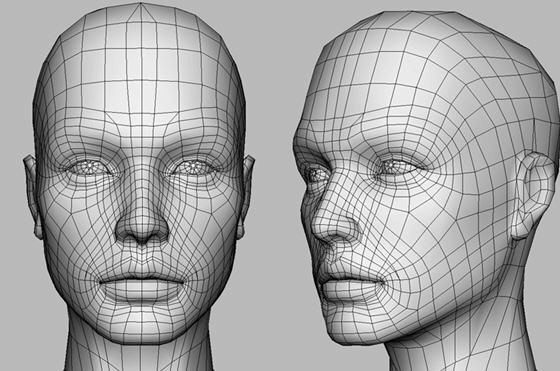

### 2. 渲染(Rendering)

有了三维模型或场景，怎么把这些三维几何模型画出来，产生令人赏心悦目的真实感图像？这就是传统的计算机图形学的核心任务，在计算机辅助设计，影视动漫以及各类可视化应用中都对图形渲染结果的高真实感提出了很高的要求。
为了模拟物理世界，已经有大量渲染模型，如光照模型，光线追踪算法以及各种更复杂真实的技术。
现代技术已经能将各种物体渲染的非常逼真，影视中大量用到了这些渲染技术，但可惜的是电影仍然需要渲染出每一帧再组合成视频。受困于GPU性能和渲染算法，我们离实时地渲染高真实感，高分辨率的场景还有大差距

### 3. 动画(Animation)

动画是采用连续播放静止图像的方法产生物体运动的效果。
研究方向包括：物理仿真(simulation)，人体动画，关节动画，运动动画，脚本动画，具有人的意识的虚拟角色的动画系统等。
另外，高度物理真实感的动态模拟，包括对各种形变、水、气、云、烟雾、燃烧、爆炸、撕裂、老化等物理现象的真实模拟，也是动画领域的主要问题。

### 4. 人机交互(Human–Computer Interaction, HCI)

人机交互（Human-Computer Interaction, 简写HCI）是指人与计算机之间以一定的交互方式或交互界面，来完成确定任务的人与计算机之间的信息交换过程

早期只有以键盘输入的字符界面，后来以WIMP(窗口、图符、菜单、鼠标)为基础的图形用户界面(GUI)逐渐成为主流，现在在WIMP基础上出现了多种交互手段，如自然语言，姿势输入，跟踪技术等等；脑机交互还在起步阶段，在医学等领域已经有了简单的应用。

## 所研究的具体问题

【1】：变换
一个几何体的变换可以看成组成改几何体的所有点的变换，平移，旋转，伸缩等
[旋转](https://zh.wikipedia.org/wiki/%E6%97%8B%E8%BD%AC)
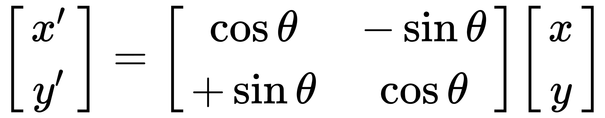

变换也包括三维到二维变换（模型、视图、投影）

【2】：光栅化（离散化三角形）
光栅化的目的，是找出一个几何单元（比如三角形）所覆盖的像素
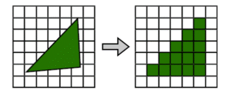

【3】：着色（光照与基本着色模型）
直接光照(镜面反射) 漫反射 间接光照(环境光)
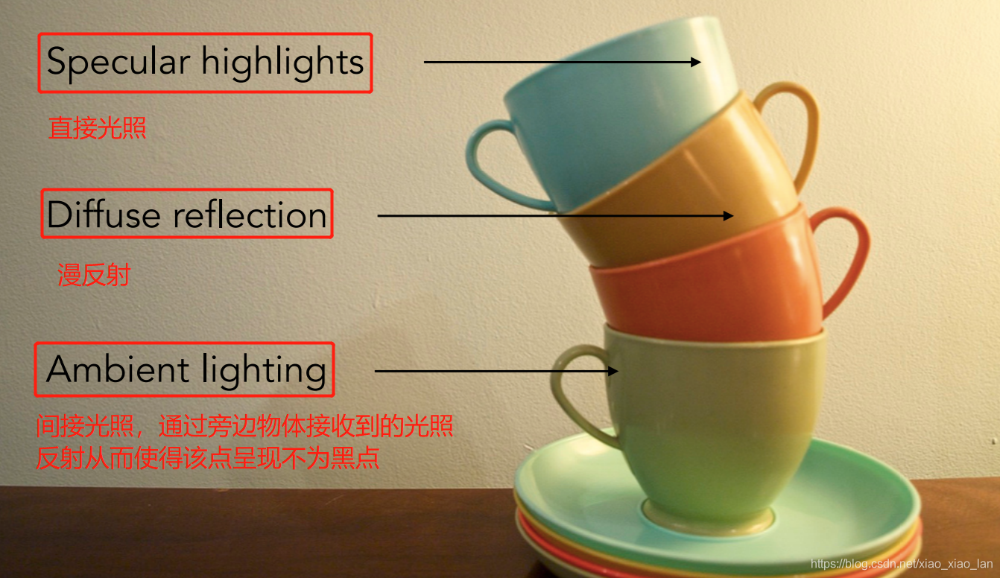

逐顶点着色
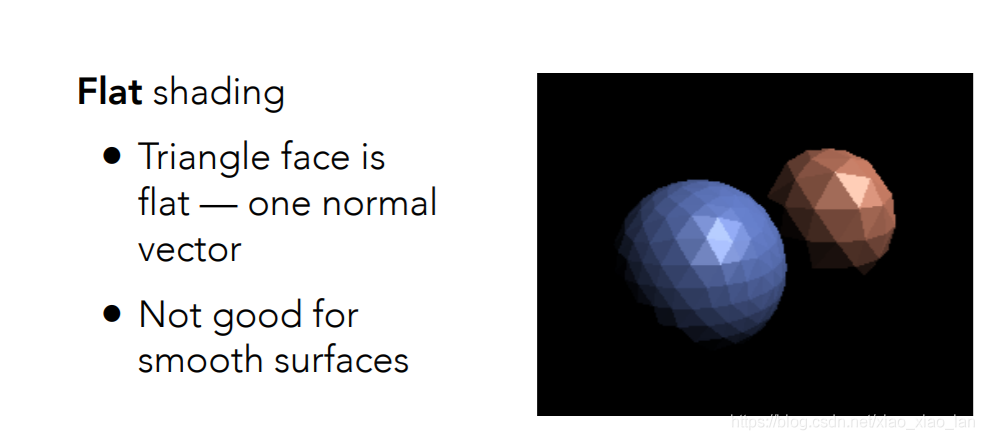
逐像素着色
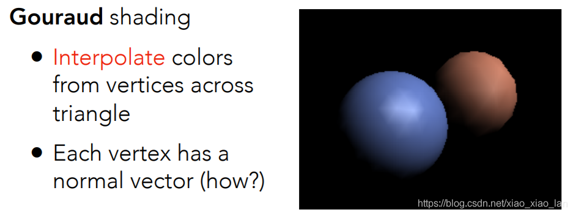

【4】：几何（基本表示方法）
隐式几何: x^2 + y^2 + z^2 = 1

显式几何:
点云
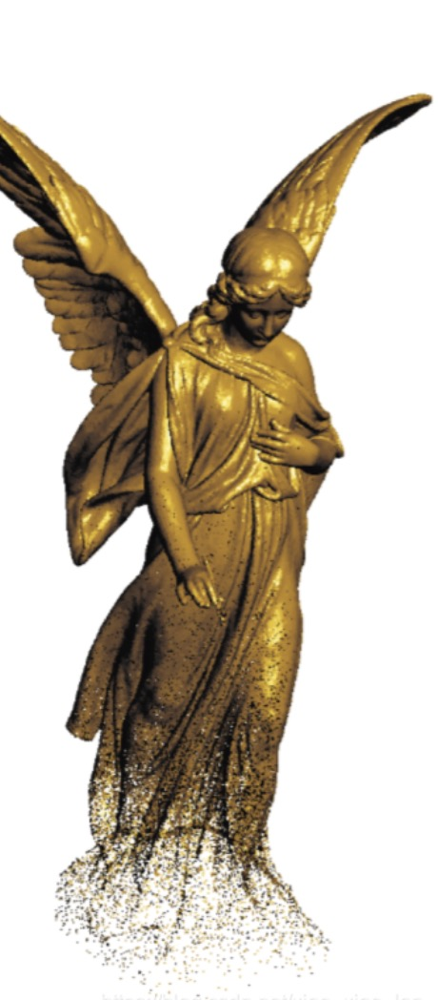
多边形网络
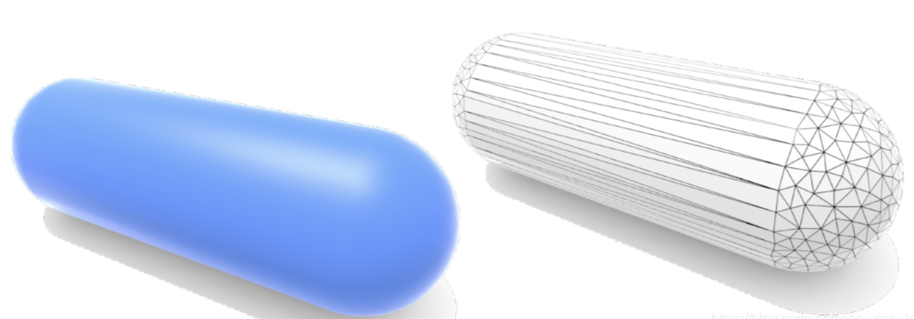

【5】：光线追踪
光线追踪三维计算机图形学中的特殊渲染算法，追踪光线从来源开始照射到物体上，再由物体反射的光线“路径”。
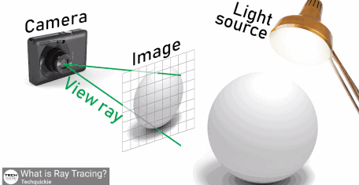

【6】：相机、透镜与光场
相机: 观察物体的地点的角度，影响可视窗口的大小，我们实际上只需要渲染可视区域。相机的变换是物体的逆变换

【7】：动画与模拟（基本概念、逆运动学、质点弹簧系统）
人体结构,刚体流体力学的应用等等

## 为什么选用跳一跳小游戏

足够简单 但涵盖了上面4个主要内容

分析:
游戏分为两个阶段 game和game-over
游戏模型分两种：一种是player，瓶子状的模型，由一个一直在旋转的头，身体，和底座组成。另一种是场景，生成随机大小的立方体或圆柱体
游戏玩法：按住屏幕player和下面的平台会压缩，松开后向前做抛物运动，落在下一个平台后加一分，否则失败，显示game over的弹窗

### 建模-一切的基础
背景搭建:
```javascript
class BackGround {
  constructor () {

  }
  init () {
    const geometry = new THREE.PlaneGeometry(width, height)
    const material = new THREE.MeshBasicMaterial({
      color: 0xd7dbe6,
      opacity: 1,
      transparent: true
    })
    this.instance = new THREE.Mesh(geometry, material)
  }
}

export default new BackGround()
```
这里我们用PlaneGeometry创建了一个平面，用MeshBasicMaterial添加了带有颜色的材质，最后把这两个都添加到Mesh里。
Mesh是网格的意思，这里所有的计算机图形都是有很多个三角形拼接而成，形似网格。后面搭建的所有模型都最终会通过new THREE.Mesh生成。

玩家搭建:
```javascript
import utils from '../utils/index'
import bottleConf from '../../confs/bottle-conf'
import blockConf from '../../confs/block-conf'
import gameConf from '../../confs/game-conf'
import { customAnimation } from '../../libs/animation'

class Bottle {
  constructor () {

  }

  init () {
    this.loader = new THREE.TextureLoader()
    this.obj = new THREE.Object3D()
    this.obj.name = 'bottle'
    this.obj.position.set(bottleConf.initPosition.x, bottleConf.initPosition.y + 30, bottleConf.initPosition.z)

    this.bottle = new THREE.Object3D()
    var texture = this.loader.load('/game/res/images/head.png')
    var basicMaterial = new THREE.MeshBasicMaterial({ map: texture })

    var headRadius = 2.1 * 0.72
    this.human = new THREE.Object3D()
    this.head = new THREE.Mesh(new THREE.OctahedronGeometry(headRadius * 1.4), basicMaterial)
    this.head.castShadow = true
    var texture2 = this.loader.load('/game/res/images/bottom.png')
    this.bottom = new THREE.Mesh(new THREE.CylinderGeometry(0.88 * headRadius, 1.27 * headRadius, 2.68 * headRadius, 20), new THREE.MeshBasicMaterial({ map: texture2 }))
    this.bottom.rotation.y = 4.7
    this.bottom.castShadow = true
    var middleGeometry = new THREE.CylinderGeometry(headRadius, 0.88 * headRadius, 1.2 * headRadius, 20)
    var texture3 = this.loader.load('/game/res/images/top.png')
    var middleMaterial = new THREE.MeshBasicMaterial({ map: texture3 })
    var materials = [middleMaterial, basicMaterial]
    var totalGeometry = new THREE.Geometry()
    middleGeometry.rotateY(4.7)
    utils.merge(totalGeometry, middleGeometry, 0, [{ x: 0, y: this.bottom.position.y + 1.94 * headRadius, z: 0 }])
    var topGeometry = new THREE.SphereGeometry(headRadius, 20, 20)
    topGeometry.scale(1, 0.54, 1)
    utils.merge(totalGeometry, topGeometry, 1, [{ x: 0, y: this.bottom.position.y + 2.54 * headRadius, z: 0 }])
    this.middle = new THREE.Mesh(totalGeometry, materials)
    this.middle.castShadow = true
    this.body = new THREE.Object3D()
    this.body.add(this.bottom)
    this.body.add(this.middle)
    this.human.add(this.body)
    this.head.position.y = 7.56
    this.head.position.x = 0
    this.head.position.z = 0
    this.human.add(this.head)
    this.bottle.add(this.human)

    this.bottle.position.y = 2.3
    this.bottle.position.x = 0
    this.bottle.position.z = 0
    this.obj.add(this.bottle)
  }
}

export default new Bottle()
```
相比于背景模型的二维平面，玩家是一个三维物体，由head, middle, bottom组成,这里我们借助new THREE.Object3D()创建三维物体。
背景模型的材质比较简单，我们直接采用了单一的颜色，对于复杂材质，它的来源可能是一张图片或者其他模型我们就要用new THREE.TextureLoader()创建材质的loader并用
```javascript
var texture = this.loader.load('/game/res/images/head.png')
var basicMaterial = new THREE.MeshBasicMaterial({ map: texture })
```
加载材质
类似的套路玩家的其他部分用到了八面体OctahedronGeometry, 球体SphereGeometry, 圆柱体CylinderGeometry等
最后把这些简单的几何体拼接起来就得到了完整的玩家模型

本游戏的模型都是由规则几何体组合而成，对于复杂模型，更好的办法是直接加载[模型文件](https://threejs.org/docs/index.html?q=model#manual/en/introduction/Loading-3D-models)
e.g.
```javascript
import { GLTFLoader } from 'three/examples/jsm/loaders/GLTFLoader.js';

const loader = new GLTFLoader();
loader.load( 'path/to/model.glb', function ( gltf ) {
	scene.add( gltf.scene );
}, undefined, function ( error ) {
	console.error( error );
} );
```

跳台搭建
略

### 渲染-让物体更真实立体
上面搭建了很多模型，但实际上他们目前只是存放在内存里的点集，现在要做的是把他们输出在显示器上。
首先，我们要有一个场景，也可以理解为容器把所有的模型加载进来。
```javascript
this.instance = new THREE.Scene()
```
接着我们把所有的模型加载到场景里
```javascript
this.instance.add(bottle)
this.instance.add(blocks)
// ...
```
然后我们需要一个渲染器来渲染场景
```javascript
this.renderer = new THREE.WebGLRenderer(
  { 
    antialias: true,
    canvas: canvas,
    preserveDrawingBuffer: true,
  }
)
```
现在我们终于能看到我们的模型了。但是人脑仍然不觉得他们是立体的，因为没有高亮和阴影。
接下来我们给场景加入光照，并让threejs自动渲染出阴影
```javascript
class Light {
  constructor () {
    this.instances = {}
  }

  init () {
    const ambientLight = new THREE.AmbientLight(0xffffff, 0.8)
    const shadowLight = new THREE.DirectionalLight(0xffffff, 0.3)
    this.shadowLight = shadowLight
    const shadowLightHelper = new THREE.DirectionalLightHelper(shadowLight, 5)
    shadowLight.position.set(10, 30, 20)
    shadowLight.castShadow = true
    var basicMaterial = new THREE.MeshBasicMaterial({ color: 0xF5F5F5 });
    this.shadowTarget = new THREE.Mesh(new THREE.PlaneGeometry(0.1, 0.1), basicMaterial)
    this.shadowTarget.visible = false
    this.shadowTarget.name = 'shadowTarget'
    this.shadowTarget.position.set(10,10,10)
    shadowLight.target = this.shadowTarget
    shadowLight.shadow.camera.near = 0.5
    shadowLight.shadow.camera.far = 500
    shadowLight.shadow.camera.left = -100
    shadowLight.shadow.camera.right = 100
    shadowLight.shadow.camera.top = 100
    shadowLight.shadow.camera.bottom = -100
    shadowLight.shadow.mapSize.width = 1024
    shadowLight.shadow.mapSize.height = 1024
    this.instances.shadowLight = shadowLight
    this.instances.ambientLight = ambientLight
    this.instances.shadowTarget = this.shadowTarget
    this.instances.shadowLightHelper = shadowLightHelper
  }
}

export default new Light()
```
这里添加了两种光源,环境光(AmbientLight)和平行光(DirectionalLight)。平行光需要设置平行光的位置
```javascript
shadowLight.position.set(10, 30, 20)
```
和照射的目标以确定光的方向
```javascript
shadowLight.target = this.shadowTarget
```
有了光源，我们还需要相机，即作为观察者的人眼的位置
```javascript
class Camera {
  constructor () {
    this.instance = null
  }

  init () {
    const aspect = window.innerHeight / window.innerWidth
    this.instance = new THREE.OrthographicCamera(-sceneConf.frustumSize, sceneConf.frustumSize, sceneConf.frustumSize * aspect, -sceneConf.frustumSize * aspect, -100, 85)
    this.instance.position.set(-10, 10, 10)
    this.target = new THREE.Vector3(0, 0, 0)
    this.instance.lookAt(this.target)
  }
}
```
我们采用了[正交相机](https://threejs.org/docs/index.html?q=OrthographicCamera#api/zh/cameras/OrthographicCamera),这一相机使用[正交投影](https://en.wikipedia.org/wiki/Orthographic_projection), 在这种投影模式下，无论物体距离相机距离远或者近，在最终渲染的图片中物体的大小都保持不变。
最后我们把场景和相机一并抛给渲染器
```javascript
this.renderer.render(this.instance, this.camera.instance)
```
### 动画-让物体东西来
我们先总结一下这里的几种运动:
* 玩家头的自旋
* 玩家body的压缩
* 玩家整体的抛物运动
* 玩家整体的旋转
* 相机跟随玩家的移动

首先，所有动画的渲染思路都是一样的，模型提供实例方法update，调用方借助浏览器requestAnimationFrame逐帧地调用update方法
```javascript
render () {
  // if (this.currentBlock) {
  //   this.currentBlock.update()
  // }
  if (this.bottle) {
    this.bottle.update()
  }
  // if (this.visible) {
  //   this.scene.render()
  // }
  requestAnimationFrame(this.render.bind(this))
}
```

忽略掉其他模型的动画，我们只以玩家的抛物运动为例。我们需要一个status标记玩家是运动还是静止的状态，两个变量vx,vy表示弹跳的初始速度，flyingTime表示当前飞行了多长时间,direction表示跳的方向。在bottle的构造函数里初始化这些数据
```javascript
  constructor () {
    this.status = 'stop' // stop || shrink || jump
    this.velocity = {
      vx: 0, // 水平方向速度
      vy: 0 //竖直方向速度
    }
    this.flyingTime = 0
    this.direction = 0
    this.scale = 1
  }
```
bottle的update方法里判断当前的状态，如果是jump，调用this._jump(tickTime)并传入当前到上次渲染的时间间隔
```javascript
  update () {
    if (this.status == 'shrink') {
      this._shrink()
    } else if (this.status == 'jump') {
      const tickTime = Date.now() - this.lastFrameTime
      this._jump(tickTime)
    }
    this.head.rotation.y += 0.06
    this.lastFrameTime = Date.now()
  }
```
我们看私有方法_jump
```javascript
  _jump(tickTime) {
    const t = tickTime / 1000
    this.flyingTime = this.flyingTime + t
    const translateH = this.velocity.vx * t
    const translateY = this.velocity.vy * t - 0.5 * gameConf.gravity * t * t - gameConf.gravity * this.flyingTime * t
    this.obj.translateY(translateY)
    this.obj.translateOnAxis(this.axis, translateH)
  }
```
我们根据时间间隔tickTime,初始速度vx vy和重力加速度gravity, 计算出横轴(根据移动方向确定x|z)上的距离变化和纵轴(y)上的距离变化。最后调用three.js原生提供的translateY和translateOnAxis完成坐标的更新

最后我们只需要一个更改当前状态的方法暴露给调用方就可以了
```javascript
jump() {
  this.status = 'jump'
}
```

## 模拟显示世界的物理运动-缓动算法
上面的动画我们通过
```javascript
render () {
  this.bottle.update()
  requestAnimationFrame(render)
}
```
来逐帧地更新模型的位置,理论上我们可以用这种模式处理所有的渲染场景。但试想这样一个场景:
一个小球在不受干扰的做简谐运动。
我们用上面的方法有类似以下的代码做动画
```javascript
// caller.js
render () {
  this.sphere.update()
  requestAnimationFrame(render)
}

// sphere.js
```


以二次函数的缓动为例
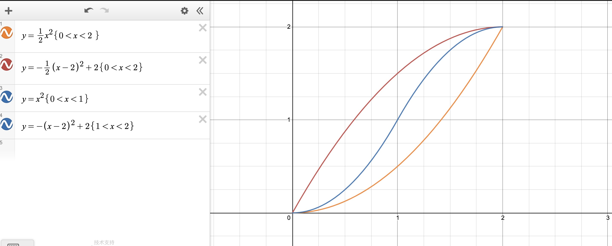

## 资料推荐

[现代计算机图形学入门](http://games-cn.org/intro-graphics/)
[视频](https://www.bilibili.com/video/av90798049)
